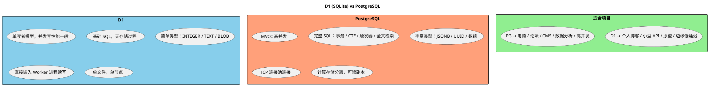

## 引言
Vercel 和 Cloudflare 是目前较为常见的两个 Web 部署平台。Vercel 偏向前端生态和开发体验，Cloudflare 则依托其全球边缘网络提供底层计算和存储能力。两者都在往"全栈应用交付平台"的方向发展，但实现路径和适用场景有所不同。

本文将介绍双方的服务和异同点，希望能帮读者理清其中的差别，从而根据自身需求做出合适的选择。

## Cloudflare

Cloudflare 依托其全球边缘网络，将计算和存储部署在离用户较近的节点上。以下是其四个核心服务。

### Workers

Workers 是一个在 Cloudflare 全球网络上运行的无服务器计算平台，基于 Service Workers API，运行在 V8 隔离环境中，启动速度快。

**能跑什么后端代码：**
Workers 运行在 V8 引擎上，不兼容完整的 Node.js API（没有 `fs`、`net` 等模块），但提供了 `fetch`、`Request`、`Response` 等 Web 标准 API。支持的编程语言包括 JavaScript、TypeScript、Rust（编译为 WASM）和 Python（通过 Pyodide）。

**能运行什么框架：**
- Web 框架：Hono、Itty Router
- 全栈框架：Astro（SSR）、SvelteKit、Remix、SolidStart
- 静态站点：Hugo、Jekyll、Zola、Astro（静态模式）

免费计划每天 10 万次请求，128 MB 内存。

### D1

D1 是 Cloudflare 的无服务器关系型数据库，基于 SQLite，可通过 Workers 直接访问或通过 HTTP API 操作，无需管理连接池。免费计划 5 GB 存储。

### KV

Workers KV 是一个全局键值存储，数据被复制到 Cloudflare 的边缘节点，适合存储配置、缓存数据等。免费计划 10 万个键。

### R2

R2 是 Cloudflare 的对象存储服务，兼容 S3 API，特点是**不收取出口流量费**。阿里云 OSS 属于同一类。它主要用于存储非结构化数据，所以可以存很多东西，甚于像本站一样的博客。免费计划 10 GB 存储。

## Vercel

Vercel 与前端的框架整合较好，提供了从开发到部署的一体化体验。

### Node.js 运行时

Vercel 的核心无服务器函数基于 Node.js 运行时，也支持 Python、Go、Ruby、Bun。函数在 AWS Lambda 上执行，可以使用完整的 Node.js API。

**能跑什么后端代码：**
函数运行在标准的 Node.js 环境中，可以访问 `fs`、`net`、`http`、`child_process` 等所有 Node.js 内置模块，也可以安装任何 npm 包。因此能跑大多数 Node.js 后端代码，包括 Express、Fastify、Apollo Server 等。注意函数有超时限制（Hobby 计划 60 秒），不适合长时间运行的后台任务。

**能运行什么框架：**
- React 框架：Next.js（原生支持最好）、Remix
- Vue 框架：Nuxt
- Svelte 框架：SvelteKit
- 通用框架：Astro、VitePress、Docusaurus、Hexo
- 几乎所有前端框架都能自动检测并选择最佳构建配置

免费计划每月 100 小时函数执行时间，单函数最大 50 MB。

### 数据库（PostgreSQL）

Vercel 与 Neon 合作提供了 Vercel Postgres（现为 Vercel Storage 的一部分），是标准的 PostgreSQL 数据库。也可以用 `pg` 或 `@vercel/postgres` 连接外部 PG 实例，如 Supabase、AWS RDS 等。

### 构建系统

Vercel 的构建系统会为每次 `git push` 自动触发构建和部署，自动检测框架并生成预览环境。免费计划每月 6,000 分钟构建时长。

## D1（SQLite）与 PG 的差异

D1 基于 SQLite，PostgreSQL（Neon）是一个独立的关系型数据库，两者差异不小：

**什么项目适合什么：**

D1 适合个人博客、小型 API、配置管理、原型项目、边缘地理位置需要低延迟的场景。不需要复杂查询和高并发，追求简单和免运维。

PostgreSQL 适合需要事务完整性、复杂查询、高并发的项目：如电商系统、论坛、内容管理系统、数据分析后台等。如果已经有现成的 PG 应用迁移过来也更合适。
